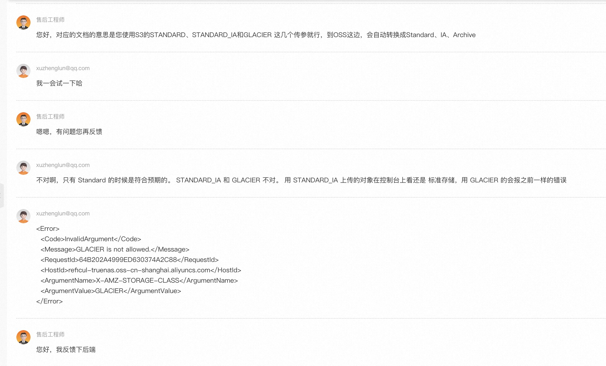

title: 备份 TrueNAS 数据至阿里云 OSS 深度冷归档存储踩坑
date: 2023-7-18 23:37
tags:
- rclone
- TrueNAS
- OSS
- S3
- 阿里云
- 深度冷归档
categories: NAS

---
可能是由于高温的原因，前段时间我的 TrueNAS 的磁盘阵列挂了。 我的阵列由四块磁盘组成，采用了 Raid1+0 的架构，这样可以保证只要不同时挂掉 Mirror 中的两块磁盘，就不会丢失数据。但是这次我的阵列突然出现了 3 块磁盘同时 S.M.A.R.T 自检失败，其中两块磁盘出现了掉盘的情况。虽然好在掉盘情况没有同时发生在同一个 Mirror 之中，不过也是足够吓人了。虽然后面经过十分痛苦的控制变量后排除了磁盘问题，锁定是 SATA 线的问题（线换了两次都是坏的，也是够倒霉的）。 考虑到磁盘都在同一个机箱内，温度、掉电等异常情况都是同时发生的，即使采用了 RAID1 冗余数据也未必安全。 

痛定思痛，考虑再把数据同步一份到云上做异地灾备就被提上了日程。这样的话，就算本地彻底玩完也可以从云上把数据重新恢复过来。考虑到本地已经采用了 RAID1+0 阵列，因此实际需要从云上恢复的概率很低了，所以灾备方案最首要考虑的是长期可延续性和性价比。这样的话，各家网盘首先因为未来运营上的不确定性排除掉了。在考虑性价比的话，就只需要找一家足够便宜的对象存储罢了。

这个过程中，踩了不少坑，希望能帮助到一些人。

<!-- more -->
# 价格
翻了下 TrueNAS 云同步任务支持的 Backend，其中 AWS S3 Glacier 无疑是这个需求上最好的选择。它足够便宜，具有极高的可用性，只要 AWS 不出大问题 S3 也不会停止运营或者缩水涨价。他的限制也很明显，不支持随时读，写入后最少支付 180 天的费用。但是这些问题在冷备的场景下都不是问题，毕竟我不可能很频繁的做数据恢复。

其次值得一提的是，B2 也是一个不错的选择。作为传统的备份方案厂商，B2 有着不俗的可用性的同时，价格只是 S3 「标准型」的五分之一，同时还有不错的社区兼容性，同时它还可以配合 Cloudflare 白嫖流量，还是很值得使用的。具体的价格我列在下面，可以对比一下。**唯一的坑是它的可用区是在注册的时候有个可选参数选择的，注册后无法更改。**

| 方案          | 每月每GB单价 | 每月存储 1TB  | GET/PUT 价格     | 流量费用    | 备注 |
| ----------   | ----------- | ----------- |---------     |------     | --- | 
| iCloud       |  -          |  `$9.9`     | -            | -         | 美区价格，</br >云上贵州狗都不去 |
| [B2 存储](https://www.backblaze.com/cloud-storage)       | `$0.005`    | `$5`         | -            | `$0.01/G` | 计价、使用都很简单 |
| [S3「标准型」](https://aws.amazon.com/cn/s3/pricing)    |  `$0.023`  |  `$23`       | `$0.005/1k次` | `$0.09/G`| 计价模型复杂 |
| [S3「深度冷归档」](https://aws.amazon.com/cn/s3/pricing)  | `$0.00099`  | `$0.99`     | `$0.05/1k次`| `$0.09/G` | 计价模型复杂</br>有解冻费用 |
| [OSS「标准型」](https://cn.aliyun.com/price/detail/oss)     | `¥0.12`    | `¥120`       | `¥0.1/1k次`  | `$0.01/G` | 计价模型复杂</br>坑多 |
| [OSS「深度冷归档」](https://cn.aliyun.com/price/detail/oss) | `¥0.005`   | `¥5`         | `¥35/1k次`  | `$0.01/G` | 计价模型复杂</br>坑多</br>有解冻费用 |

S3 因为 GFW 的原因，在国内基本上用不了。所以自然是只剩下了 B2 和 OSS 两个选择。先使用 [B2 测速链接](https://www.backblaze.com/cloud-backup/resources/speedtest)测速，选择一个较快的可用区。我这边的网络情况是浙江联通 50Mbps 上传，深夜对美西可用区可以跑到 5MB/s 左右的样子，其实是不错啦。而且 TrueNAS 对 B2 有原生的支持，只需要将在 B2 上创建的密钥配置进 TrueNAS 配置好云凭据，就能很方便的创建云同步任务了。

# 同行衬托
先让我们先试牛刀，配置一个 B2 试试看。大致步骤就如下两张图可以概括，非常丝滑：
1. 配置云凭据
  
2. 配置云同步任务
  

---

# 噩梦开始

下面是正文 OSS 的部分。和 B2 类似，下面先把OSS 的配置部分贴出来。但是如果不做以下的额外事情，是不能用的。由于过程中涉及工单，整个过程需要人工介入，快的话下来大概需要1天。这个过程踩了不少坑，我实际下来大概花了一周左右才解决。

1. 配置云凭据
   1. 下图的 Endpoint 部分，填写对应 Bucket 所在 Region 的地址，具体可以[查询文档](https://help.aliyun.com/document_detail/31837.html)。我这里是华东上海，所以填的是如图的地址。
   
   2. AccessKey 和 SecretKey 需要去 RAM 控制台创建一个「用户」，并给与绑定足够的「权限策略」。我这里是赋予了他除了删除 bucket 等少数敏感权限以外的全部权限，可以按实际需要配置。

2. 配置云同步任务，但是注意：
   
   1. 值得注意的是，在完成下文提到的[「1. 让 TrueNAS 支持 OSS」](#1-让-TrueNAS-支持-OSS)之前，编辑页面无法正常列出 Bucket。
   2. 使用 `--fast-list` 减少 API 调用可以省一些钱，否则就算每次同步的时候实际没有增量，也会因为 LIST 对象的时候的 API 调用产生高额费用；
   3. 值得注意的是，存储类别采用 `GLACIER` 类型，这个类型对应在 OSS 的是「归档型」，而非是「深度冷存档」。但是为了使用「深度冷存档」来降低费用，还要按[「2. 开通「深度冷归档」功能」](#2-开通「深度冷归档」功能)里描述的联系客服后后才能开通。在开通后，就可以通过配置对象生命周期自动转换类型规则。
   4. 阿里云 OSS 在加密这块的支持是没有问题的，可以正常使用。我这里配置了加密的，一来数据在国内我不放心，二来「There is no cloud, just other people's computers」。

3. 上面搞完之后，直接用是不可能用的了的，还需要解决下面额外的事情。

## 额外工作
### 1. 让 TrueNAS 支持 OSS
这一步是最简单的，TrueNAS 云同步任务后台采用的其实是 [Rclone](https://rclone.org/)。由于 OSS 支持 S3 API，所以理论上 Rclone 用 S3 API 应该也是可以工作的。但是实际上，因为[阿里云并非完全兼容 S3](https://help.aliyun.com/document_detail/389025.html)，所以直接配置是会失败的。

通过[翻阅文档](https://rclone.org/s3/#alibaba-oss)和[代码](https://github.com/rclone/rclone/commit/a4af737bf021a73ee7a2324f101569de20ce8be7)，实际上 Rclone 是可以使用 S3 API 来支持 OSS 的。唯一的改动是需要添加一个配置，只需要关闭 `force_path_style` 功能或者正确配置 `provider` 参数即可。

可惜的是 TrueNAS 不支持自定义 Flag 参数的填写。通常的方法是放弃 Web GUI，自己写一个脚本放到 CronJob 里跑。但是在任务失败的异常中我发现，TrueNAS 同步模块是 Python 写的，所以我们完全可以魔改一下让他支持。

ssh 到 TrueNAS 机器上，我的 TrueNAS 版本是 `TrueNAS CORE® © 2022`，其他版本可以自己参考下。打开并编辑下面代码块内的文件，在下面图中所在行数添加代码，**注意缩进**。保存过后，执行 `service middlewared restart` 重启 Web 服务。

```Python
#vim /usr/local/lib/python3.9/site-packages/middlewared/plugins/cloud_sync.py
        if "aliyuncs.com" in config.get("endpoint", ""):
            logger.warning(f"set provider for {config['endpoint']} as Alibaba")
            config["provider"] = "Alibaba"
```


### 2. 开通「深度冷归档」功能
直接创建 Bucket 的时候会发现，实际上并没有「深度冷归档」功能。查阅[OSS 文档](https://help.aliyun.com/document_detail/2399408.html)发现，「深度冷归档」功能需要人工开通。好吗，毕竟文档白纸黑字说了，而且这个是个新上的功能，情有可原没什么好说的。创建一个「标准型」的 Bucket，然后在工作日开工单，等就完了。

开通之后，就可以正常使用「深度冷归档」功能了。但是需要注意的是，直接上传到「深度冷归档」的 API 调用费用非常昂贵，而如果上传至「冷归档」再转换到「深度冷归档」则会额外收取 180 天的提前删除费用。相比下来，通过上传对象至「归档型」存储类型，然后通过生命周期自动转换到「深度冷归档」并不会收取额外的费用。因此，这里还需要配置如下的生命周期规则。这里需要额外注意到是，「深度冷归档」功能如果文件小于 128KB 会按照 128KB 收费，如果存在大量小文件则不宜全部转换。


### 3. 开通S3 API开通
TLDR，这里先给结论：和[OSS与Amazon S3的兼容性](https://help.aliyun.com/document_detail/389025.html)里描述不同的是，OSS 默认情况下S3 API 的 StorageClass 参数是完全无法正常使用的。如果要正常使用，需要开工单找客服去要求「添加白名单」。


#### 牢骚

接下来是发牢骚并交代细节的部分了，过程总计大致有 3 个来回。

##### Round 1
如果按上面兼容性文档字面意思描述的意思的话，在需要将上传对象的类型设置为「归档型」类型的时候，需要在 S3 SDK 内将 StorageClass 字段设置为 `Archive`。毕竟我语文比较差，为了避免理解有误，我咨询了客服做了确认。沟通过程还是比较流畅的，答曰如下：


如果你也和我一样信了邪，傻傻的使用了 `Standard`、`IA` 和 `Archive` 的话，那你会收获到如下的异常返回。可以看到三种 ClassStorage 是没有一个能用的。

<details>

```XML
<Error>
  <Code>InvalidStorageClass</Code>
  <Message>The storage class you specified is not valid</Message>
  <RequestId>64B17B63725B7333353154A1</RequestId>
  <HostId>reficul-truenas.oss-cn-shanghai.aliyuncs.com</HostId>
  <StorageClassRequested>Archive</StorageClassRequested>
</Error>


<Error>
  <Code>InvalidStorageClass</Code>
  <Message>The storage class you specified is not valid</Message>
  <RequestId>64B17C51F651CD33381690FF</RequestId>
  <HostId>reficul-truenas.oss-cn-shanghai.aliyuncs.com</HostId>
  <StorageClassRequested>IA</StorageClassRequested>
</Error>


<Error>
  <Code>InvalidStorageClass</Code>
  <Message>The storage class you specified is not valid</Message>
  <RequestId>64B17CAFA9FF3B32324D7BDA</RequestId>
  <HostId>reficul-truenas.oss-cn-shanghai.aliyuncs.com</HostId>
  <StorageClassRequested>Standard</StorageClassRequested>
</Error>
```

</details>


##### Round 2

这时候就不得不再开一个工单再咨询之，客服B 答曰这个异常是 SDK 返回的。言下之意 S3 的 SDK 校验了枚举值，是我自己的锅。看似很有道理，但是仔细一想就不对。首先，这个错误明显是服务端响应的，因为使用 `RequestId` 可以在 OSS 的自助诊断工具内查询到相同的错误码，没理由/不太可能客户端里的异常会选择上报到服务端上去。其次，我仔细翻看了 Go S3 API 的校验逻辑后（如下图），确定了并没有校验 StorageClass 枚举值。


追问之，表示不好意思之前的 Round 1的客服A 说错了，文档正确的理解是 OSS 会自动转换枚举值，我只管用 S3 的标准值就行了。原来不止我一个人语文不好，客服A 和我也一样不好。那行吧，毕竟「文档不准确这种情况」大家都是程序员也都能理解（又不是不能用.jpg）。



刚到嘴边的「又不是不能用」还没说出来，好死不死还真的不能用。如果你也像我一样信了他的邪，你会发现只有设置 `STANDARD` 的时候是正确响应的。如果预期设置的是「低频访问」 `STANDARD_IA` 的话，上传上去的对象还是「标准型」，如果预期设置的是「归档型」 `GLACIER` 的话，就直接报错无法上传。不过仔细看的话会发现错误码变了，从 `The storage class you specified is not valid` 变成了 `GLACIER is not allowed.`。

```XML
<Error>
  <Code>InvalidArgument</Code>
  <Message>GLACIER is not allowed.</Message>
  <RequestId>64B202A4999ED630374A2C88</RequestId>
  <HostId>reficul-truenas.oss-cn-shanghai.aliyuncs.com</HostId>
  <ArgumentName>X-AMZ-STORAGE-CLASS</ArgumentName>
  <ArgumentValue>GLACIER</ArgumentValue>
</Error>
```

##### Round 3
十分无奈的三问客服，这次和往常不同的是经过了很长时间的调查。经过一段时间的等待后，告知 S3 API 是非标功能，需要后台加白。而且，对待已有对客文档的前提下，以及对对象存储事实标准的 S3 API 的态度是：**「您好，我们只是兼容，不代表默认就支持」**。其实吧，大家都是码农也都能理解，承认是个 Bug 后台 Hack 了下没啥丢人的。但是面对这种既好笑又熟悉的对客态度，我只想说：行吧，「你清高，你了不起」。


回过神想想，这么低级的问题都要这样踩坑，这么多人都没发现正巧遇到我个倒霉蛋，只能说我这个已经是高级用法了，国内公有云市场就已经这样了？还是说就 OSS 已经没人用了？另外，我很好奇的是如果这个文章有人能看到，在提交的工单多了、时间久了之后，这个地方还会是这样么？

## 总结
接下来就是等下个月账单了，我也再次衷心的希望这篇流水账能帮助到一些人。

在国内，阿里云在公有云市场基本上是垄断的地位，但是这次的体验只能说是差强人意。作为云计算知母的对象存储使用起来的体验都如此这般，我只能说比较遗憾和失望。~~云计算在国内不存在了。~~ 

回头想想，我们到底在做什么？这次最失望的不是问题本身，而是一个热路径上竟然存在这样的低级问题，竟然要用工单的方式手动解决，竟然回复的口径是这么的高傲（可悲的是这种口径我竟然觉得还挺熟悉的）。在这个过程中隐隐约约似乎看到了自己平时打工时候的影子，可能也是对自己失望了吧。
